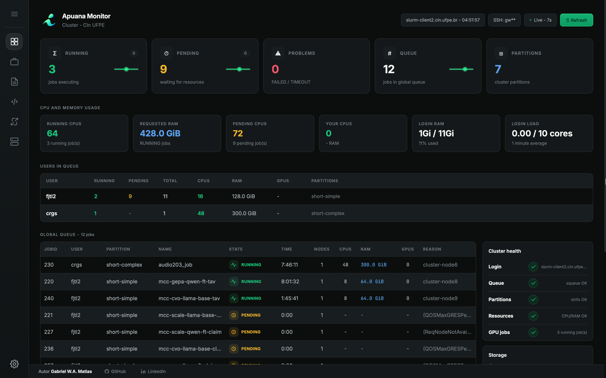
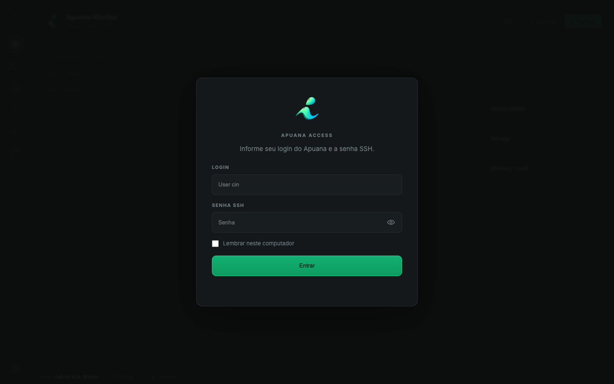

<p align="center">
  
</p>

<h1 align="center">Apuana Monitor</h1>

<p align="center">
  Dashboard local para acompanhar filas, jobs, GPUs, logs, arquivos remotos e transferências no cluster Apuana.
</p>

<p align="center">
  <a href="https://www.python.org/"></a>
  <a href="https://www.paramiko.org/"></a>
  <a href="https://pypi.org/project/keyring/"></a>
  <a href="https://pywebview.flowrl.com/"></a>
  <a href="https://pyinstaller.org/"></a>
  
  
  
</p>

---

## Motivação

O **Apuana Monitor** foi desenvolvido para facilitar o acompanhamento e gerenciamento de atividades no cluster Apuana do CIn/UFPE de forma mais prática e organizada. A rotina de verificar filas, jobs, GPUs, logs e arquivos remotos normalmente exige múltiplos comandos e conexões manuais, o que pode tornar o fluxo de trabalho desafiador e pouco intuitivo, principalmente durante desenvolvimento, depuração e execução de experimentos.

O projeto reúne essas operações em uma interface local simples, permitindo acompanhar o estado do cluster, acessar logs e gerenciar arquivos com maior praticidade. Essa iniciativa visa fornecer uma ferramenta de apoio que torne o uso do ambiente mais direto e eficiente, preservando o fluxo operacional e as ferramentas nativas do ambiente.

## Referências oficiais

- [Página do Apuana](https://apuana.cin.ufpe.br/)
- [Helpdesk CIn: Cluster Apuana](https://helpdesk.cin.ufpe.br/servicos/cluster-apuana)

<p align="center">
  
</p>

## O que ele faz

- mostra o estado geral do cluster e das partições SLURM
- acompanha jobs, filas e uso de GPU
- abre logs `.out` e `.err`
- navega por arquivos remotos em `/home/CIN/<usuario>`
- faz upload e download por sessão SSH autenticada
- cria um app/atalho **Apuana Monitor** na Área de Trabalho na primeira execução

## Requisitos

- Python 3.9+
- conta SSH ativa no Apuana
- VPN/rede com acesso aos hosts do CIn (obrigatório)

O repositório inclui `.tool-versions` para `asdf`/`mise`, com Python 3.12.12 e fallback para o Python do sistema. Quem não usa gerenciador de versões precisa apenas manter Python 3.9+ instalado.

## Rodar pela primeira vez

Clone o projeto e entre na pasta:

```bash
git clone <repository-url>
cd apuana_cluster_monitoring
```

### macOS

<p align="center">
  
</p>

Por enquanto, o app macOS deve ser gerado na própria máquina do usuário. Isso evita distribuir um pacote sem notarização da Apple e mantém o fluxo mais transparente.

```bash
./run.sh
```

Na primeira execução, o projeto instala as dependências locais, usa PyInstaller quando disponível e cria **Apuana Monitor.app** na Área de Trabalho.

Se quiser apenas preparar o app sem abrir a interface:

```bash
python run.py --prepare-only
```

### Linux

```bash
./run.sh
```

### Windows

```bat
run.bat
```

Na primeira execução, o script cria `.venv`, instala as dependências do `requirements.txt` apenas quando necessário, prepara o app/atalho **Apuana Monitor** na Área de Trabalho e abre:

```text
http://127.0.0.1:8501/
```

No macOS, quando o ambiente permite, esse app é empacotado com PyInstaller para aparecer como **Apuana Monitor** no Dock, com nome e ícone próprios. No Linux e Windows, o projeto cria launchers nativos do sistema e mantém fallback para o navegador padrão quando uma janela nativa não estiver disponível.

## Próximas execuções

<p align="center">
  
</p>

Depois da primeira execução, basta abrir o **Apuana Monitor** na Área de Trabalho. Ele inicia o servidor local em segundo plano e abre a interface sem precisar abrir IDE ou terminal. Se o app já estiver rodando, o launcher reaproveita a sessão local.

Logs de inicialização ficam no diretório padrão do sistema:

```text
macOS: ~/Library/Logs/Apuana Monitor/
Windows: %LOCALAPPDATA%\Apuana Monitor\logs\
Linux: ~/.cache/apuana-monitor/
```

## Login e segurança

O servidor roda apenas na máquina do usuário, em `127.0.0.1`, e só abre uma sessão SSH com o Apuana depois do login no navegador.

Faça login com seu usuário e senha SSH do Apuana. Se marcar **Lembrar neste computador**, a senha é salva no cofre seguro do sistema operacional via `keyring` e usada apenas para abrir novas sessões SSH locais. Nenhuma senha é salva no repositório.

<p align="center">
  
</p>

## Opções

```bash
./run.sh --port 8520
./run.sh --host slurm-client1.cin.ufpe.br
./run.sh --transfer-host slurm-client1.cin.ufpe.br
./run.sh --no-browser
```

Também é possível configurar por ambiente:

```bash
SLURM_MONITOR_PORT=8520 ./run.sh
SLURM_MONITOR_SSH_HOST=slurm-client1.cin.ufpe.br ./run.sh
SLURM_MONITOR_TRANSFER_HOST=slurm-client1.cin.ufpe.br ./run.sh
```

## Estrutura

```text
run.py
run.sh
run.bat
requirements.txt
apuana/dashboard/
  run.sh
  server/
  static/
apuana/bin/
apuana/lib/
```

## Validação local

```bash
python -m compileall -q apuana/dashboard/server
bash -n run.sh
bash -n apuana/dashboard/run.sh
```

Se tiver Node.js instalado:

```bash
find apuana/dashboard/static/scripts -name '*.js' -print0 | xargs -0 -n1 node --check
```

## Licença

Este projeto usa a **PolyForm Noncommercial License 1.0.0**.

Você pode estudar, usar, modificar e contribuir para fins não comerciais, mantendo os créditos e avisos de licença. Uso comercial, revenda, redistribuição paga ou incorporação em produto/serviço comercial exige autorização prévia por escrito.
